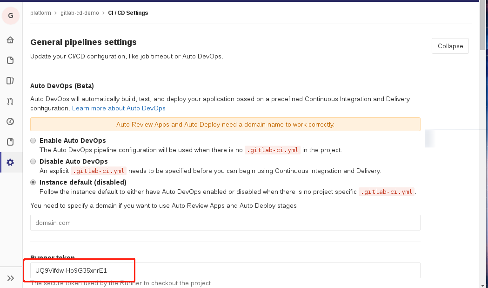

## 实现功能
   
   通过脚本生成gitlab-runner在k8s上运行部署对应yaml， 通过yaml把gitlab runner 部署到k8s上。 

### 获取Get GitLab CI runner registry token

1) 进入页面**Settings** -> "CI/CD" 

2) 展开**General pipelines settings** 如图


### 运行脚本生成对应yaml文件
  
```
$ generate-gitlab-runner-yaml.sh autodeploy UQ9Vifdw-Ho9G35xnrE1 git.tuputech.com
```
- 参数1：对应gitlab runner部署k8s命名空间
- 参数2：runner registry token
- 参数3：gitlab url 

执行以后生成对应命名空间目录， 目录下面有一下文件：

- gitlab-ci-runner-scripts-cm.yaml  
- gitlab-runner-cm.yaml  
- gitlab-runner-statefulset.yaml  
- namespace.yaml  
- rbac.yaml  
- secret-token.yaml

### 原理

### 创建runner对应命名空间 
   这个是gitlab runner 运行命名空间， 与实际项目运行命名空间不一样的， 

namespace.yaml
```
apiVersion: v1
kind: Namespace
metadata:
  name: YOUR_GITLAB_BUILD_NAMESPACE
```

### ConfigMap for the Environment Variables and Script
 
   配置gitlab runner 运行时候内存， cpu限制, 后面把这些导入环境变量里面去。

gitlab-runner-cm.yaml 
```
apiVersion: v1
kind: ConfigMap
metadata:
  labels:
    app: gitlab-ci-runner
  name: gitlab-ci-runner-cm
  namespace: __YOUR_GITLAB_BUILD_NAMESPACE__
data:
  REGISTER_NON_INTERACTIVE: "true"
  REGISTER_LOCKED: "false"
  CI_SERVER_URL: "__YOUR_GITLAB_CI_SERVER_URL__"
  METRICS_SERVER: "0.0.0.0:9100"
  RUNNER_REQUEST_CONCURRENCY: "4"
  RUNNER_EXECUTOR: "kubernetes"
  KUBERNETES_NAMESPACE: "__YOUR_GITLAB_BUILD_NAMESPACE__"
  KUBERNETES_PRIVILEGED: "true"
  KUBERNETES_CPU_LIMIT: "1"
  KUBERNETES_MEMORY_LIMIT: "1Gi"
  KUBERNETES_SERVICE_CPU_LIMIT: "1"
  KUBERNETES_SERVICE_MEMORY_LIMIT: "1Gi"
  KUBERNETES_HELPER_CPU_LIMIT: "500m"
  KUBERNETES_HELPER_MEMORY_LIMIT: "100Mi"
  KUBERNETES_PULL_POLICY: "if-not-present"
  KUBERNETES_TERMINATIONGRACEPERIODSECONDS: "10"
  KUBERNETES_POLL_INTERVAL: "5"
  KUBERNETES_POLL_TIMEOUT: "360"
```

  下面是启动脚本configmap 
  gitlab-ci-runner-scripts-cm.yaml 
```
apiVersion: v1
kind: ConfigMap
metadata:
  labels:
    app: gitlab-ci-runner
  name: gitlab-ci-runner-scripts
  namespace: __YOUR_GITLAB_BUILD_NAMESPACE__
data:
  run.sh: |
    token=
    CONFIG_File="/etc/gitlab-runner/config.toml"
    unregister() {
        kill %1
        echo "Unregistering runner ${RUNNER_NAME} ..."
        /usr/bin/gitlab-ci-multi-runner unregister -t "$(/usr/bin/gitlab-ci-multi-runner list 2>&1 | tail -n1 | awk '{print $4}' | cut -d'=' -f2)" -n ${RUNNER_NAME}
        exit $?
    }

    # trap 'unregister' EXIT HUP INT QUIT PIPE TERM
    # 判断runner是否已经创建
    if [  -f "$CONFIG_File" ]; then
        echo "Find token in $CONFIG_File"
        token=$(grep "token" "$CONFIG_File")	
    fi

    if [ -z "$token" ]; then
        echo "Runner do not exist, need to registry new runner....."
        echo "Registering runner ${RUNNER_NAME} ..."
        /usr/bin/gitlab-ci-multi-runner register -r ${GITLAB_CI_TOKEN}
        sed -i 's/^concurrent.*/concurrent = '"${RUNNER_REQUEST_CONCURRENCY}"'/' "$CONFIG_File"
        echo  '
        [[runners.kubernetes.volumes.host_path]]
          name = "docker-sock"
          mount_path = "/var/run/docker.sock"
          read_only = false
          host_path = "/var/run/docker.sock" '  \
        >> "$CONFIG_File"
    fi
    echo "Starting runner ${RUNNER_NAME} ..."
    /usr/bin/gitlab-ci-multi-runner run -n ${RUNNER_NAME}

```

### Secret for the Token Environment Variable（配置项目token到runner）

需要base64 编码

$ echo YOUR_GITLAB_CI_TOKEN | base64 -w0

secret-token.yaml
```
apiVersion: v1
kind: Secret
metadata:
  name: gitlab-ci-token
  namespace: __YOUR_GITLAB_BUILD_NAMESPACE__
  labels:
    app: gitlab-ci-runner
data:
   GITLAB_CI_TOKEN: YOUR_BASE64_ENCODED_TOKEN
```

