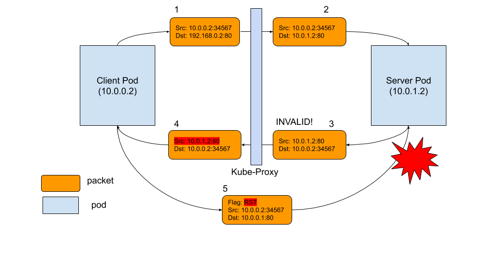

## Kubenetes Service 地址 tcp 长连接重置或很久连接不上

### 存在问题

当节点网络比较繁忙的时候，发现通过`service ip`创建tcp连接被重置，连接不上问题。通过tcpdump抓包发现, 远程包已经回应，但是src ip地址pod地址，不是service地址。连接不断创建，rest。和dns问题差不多，有问题的时候，远程回应包src地址没有被替换为对应service，导致tcp连接同步重新发送


## Kubernetes网络基础知识
在深入研究这个问题之前，让我们先谈谈Kubernetes网络的一些基础知识，因为Kubernetes网络通信方式有下面几个：

### Pod to Pod
在Kubernetes中，每个`pod`都有自己的IP地址。好处是在`pod`中运行的应用程序可以使用它们的规范端口，而不是重新映射到不同的随机端口。`Pod`之间具有L3连接。它们可以相互ping通，并相互发送TCP或UDP数据包。 CNI是解决在不同主机上运行的容器的此问题的标准。有大量不同的插件支持CNI。

### Pod to 集群外部
对于从`pod`访问kubernetes集群以外地址，Kubernetes只使用`SNAT`。它的作用是用`hostIP:端口`替换`podIP:端口`。当外部机器返回数据包返回主机时，它会将目标重写为`pod的IP:端口`，并将其发送回原始pod。整个过程对原始pod是透明的，pod根本不知道地址转换。

### Pod to ClusterIP
Kubernetes有一个叫做`Service`的概念，它只是一个在pod前面的L4负载均衡器。有几种不同类型的服务。最基本的类型称为ClusterIP。对于此类服务，它具有唯一的VIP地址，该地址只能在群集内路由。

Kubernetes中实现此功能的组件称为`kube-proxy`。它位于每个节点上，并编写复杂的iptables规则/创建IPVS，以便在pod和服务之间进行各种过滤和NAT。如果您转到Kubernetes节点并键入iptables-save，您将看到Kubernetes或其他程序插入的规则。最重要的链是KUBE-SERVICES，KUBE-SVC-* 和KUBE-SEP-*。

iptables
```
KUBE-SERVICES是服务包的入口点。它的作用是匹配目标IP：端口并将数据包分派到相应的 KUBE-SVC-*链。
KUBE-SVC-*chain充当负载均衡器，并将数据包KUBE-SEP-*平均分配到 链。每个链的数量与其后面的端点数KUBE-SVC-*相同 KUBE-SEP-*。
KUBE-SEP-*chain代表服务端点。它只是做DNAT，用pod的端点IP：端口替换服务IP：端口
```


对于DNAT，conntrack使用状态机启动并跟踪连接状态。需要状态是因为它需要记住它更改为的目标地址，并在返回的数据包返回时将其更改回来。Iptables还可以依靠conntrack状态（ctstate）来决定数据包的命运。那4个conntrack状态特别重要：

NEW：conntrack对此数据包没有记录，这是在TCP SYN数据包时发生的。
ESTABLISHED：conntrack知道数据包属于已建立的连接，这在TCP握手完成后发生。
RELATED：数据包不属于任何连接，但它附属于另一个连接，这对于FTP等协议特别有用。
INVALID：数据包有问题，conntrack不知道如何处理它。这个状态在这个Kubernetes问题中起着中心作用。

下面是一个TCP连接如何在pod和服务之间工作的图表。事件的顺序是：

- 左侧的客户端pod将数据包发送到服务：192.168.0.2:80
- 数据包通过客户端节点中的iptables规则，目标更改为pod IP，10.0.1.2：80
- Server pod处理数据包并发回目标为10.0.0.2的数据包
- 数据包将返回客户端节点，conntrack识别该数据包并将源地址重写回192.169.0.2:80
- Client pod接收响应数据包


### 什么导致连接重置？

如下图所示，问题是数据包3.当conntrack无法识别返回的数据包时，将其标记为INVALID。最常见的原因包括：
- 1) conntrack无法跟踪连接，因为它超出了容量. 
- 2) 数据包本身超出了TCP窗口等。

对于那些已被标记为INVALID的数据包通过conntrack状态，我们没有iptables规则来删除它，因此它将被转发到客户端pod，源IP地址不被重写（如数据包4所示）

客户端pod无法识别此数据包，因为它具有不同的源IP，即pod IP，而不是服务IP。结果，客户端pod说"我不记得这个IP的连接曾经存在，为什么这个家伙继续向我发送这个数据包？" 基本上，客户端做的只是发送一个RST数据包到服务器pod IP，即数据包5.

不幸的是，这是一个完全合法的pod-to-pod数据包，可以传送到服务端. 服务端回应："好吧，客户端pod不想跟我说话，所以让我们关闭连接！" 轰！当然，为了使所有这些发生，RST数据包也必须合法，具有正确的TCP序列号等。但是当它发生时，双方同意关闭连接。



### 解决方法

- 首先加大conntrack表大小，避免情况一出现
- 数据包本身超出了TCP窗口等： 可以通过 echo 1 > /proc/sys/net/ipv4/netfilter/ip_conntrack_tcp_be_liberal 让contrack丢弃无效数据包，当然也可以通过iptable丢弃这些无效数据包。参考： https://github.com/kubernetes/kubernetes/pull/74840

这些配置需要持久化可以编辑文件：

`/etc/sysctl.conf`
```
...
net.netfilter.nf_conntrack_tcp_be_liberal=1
net.netfilter.nf_conntrack_max=10485760
net.netfilter.nf_conntrack_buckets=655360
net.core.netdev_max_backlog=250000
net.ipv4.neigh.default.gc_thresh1=1024
net.ipv4.neigh.default.gc_thresh2=4096
net.ipv4.neigh.default.gc_thresh3=8192
fs.file-max=10000000
fs.inotify.max_user_instances=524288
fs.inotify.max_user_watches=524288
net.ipv4.tcp_tw_reuse=1
...
```

执行下面命令更新到内核
```
$sysctl -p /etc/systl.conf
```