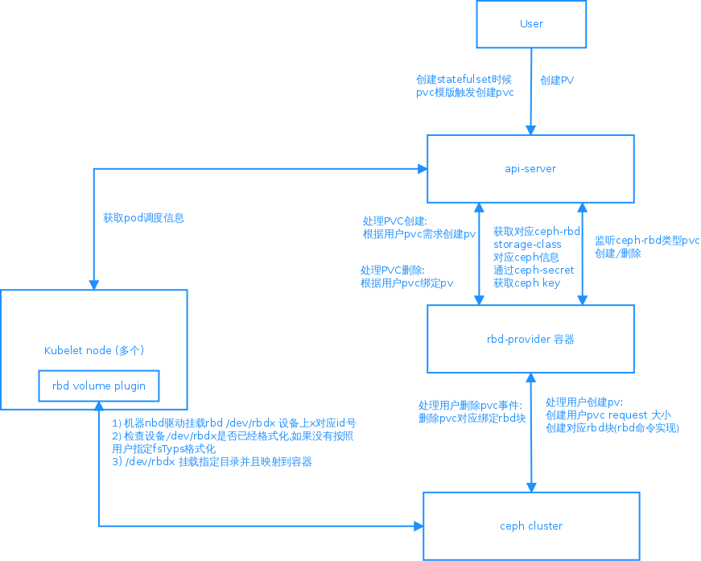

## Kubernetes使用ceph rbd 持久化存储

### rbd 在kubernets使用

  通过rbd-provider 提供服务简化rbd在kubernetes使用, 调用关系如下:




- rbd 块设备创建和删除由rbd-provider自动化做
- 用户不需要编写pv.yaml 注册rbd块到k8s上, 由rbd-provider监控api-server上pv改变实现自动化增加和删除
- rbd创建以格式化kubelet device-plugin实现格式化, 用户可以在storage-class上指定fsType, 例如xfs, ext4
- 当用户删除pvc时候,rbd-provider删除对应rbd块,释放ceph空间

### 使用 kubernetes 集群外部的 Ceph 存储

在部署 kubernetes 之前我们就已经有了 Ceph 集群，因此我们可以直接拿来用。但是 kubernetes 的所有节上依然需要安装 ceph 客户端，安装命令
```
$ yum install -y ceph-common
``` 

配置如下:
- ceph.conf放在所有节点的 /etc/ceph 目录下

- ceph.client.admin.keyring 放在所有节点的 /etc/ceph目录下

### Kubernetes配置 Ceph

#### 生成 Ceph secret

```
$grep key /etc/ceph/ceph.client.admin.keyring |awk '{printf "%s", $NF}'|base64

QVFEaFJFZGJLdWEyQ3hBQTVmWmRJZExTamVjbXpWTGFmZUEwbFE9PQ==
```

创建 ceph-secret.yaml 文件内容为：
```
apiVersion: v1
kind: Secret
metadata:
  name: ceph-secret
  namespace: kube-system
type: "kubernetes.io/rbd"  
data:
  key: QVFEaFJFZGJLdWEyQ3hBQTVmWmRJZExTamVjbXpWTGFmZUEwbFE9PQ==
```

配置集群上
```
$ kubectl apply -f ceph-secret.yaml
```

### 创建 StorageClass

rbd-storageclass 会被rbd-provder调用创建对应块存储使用需要用到信息

- ceph 存储信息: monitor地址
- rbd-provider 管理rbd使用的帐号: adminId, admin 需要用到ceph key 对应SecretName还有用户空间
- rbd-provider: 使用存储池
- 用户pod挂载rbd使用使用帐号: userId, 用户pod挂载rbd使用ceph key存放userSecretName， 需要每个用户空间有此名称的secret

```
apiVersion: storage.k8s.io/v1
kind: StorageClass
metadata:
   name: ceph-rbd
provisioner: kubernetes.io/rbd
parameters: 
  monitors: 172.25.52.205           #多个Monitor需要以','分割
  # rbd-provider 需要使用的ceph信息
  adminId: admin
  adminSecretName: ceph-secret
  adminSecretNamespace: kube-system
  pool: rbd #此处默认是rbd池，生产上建议自己创建存储池隔离
  # rbd block dev 格式化文件格式
  fsType: xfs
  # 用户pod 挂载rbd block dev 需要使用信息 
  userId: admin
  # 每个用户都需要创建对应ceph-secret， 否则创建pod 挂载对应rbd块存储时候失败 
  userSecretName: ceph-secret
  # kubelet挂载rbd使用userSecre所在命名空间,如果配置都使用kube-system, 否则每个用户空间都需要配置ceph-secret
  userSecretNamespace: kube-system
```

### 部署 rbd-provider

yaml 参考https://github.com/kubernetes-incubator/external-storage/blob/master/ceph/rbd/deploy/rbac/deployment.yaml

配置cluster role
```
kind: ClusterRole
apiVersion: rbac.authorization.k8s.io/v1
metadata:
  name: rbd-provisioner
rules:
  - apiGroups: [""]
    resources: ["persistentvolumes"]
    verbs: ["get", "list", "watch", "create", "delete"]
  - apiGroups: [""]
    resources: ["persistentvolumeclaims"]
    verbs: ["get", "list", "watch", "update"]
  - apiGroups: ["storage.k8s.io"]
    resources: ["storageclasses"]
    verbs: ["get", "list", "watch"]
  - apiGroups: [""]
    resources: ["events"]
    verbs: ["list", "watch", "create", "update", "patch"]
  - apiGroups: [""]
    resources: ["services"]
    resourceNames: ["kube-dns"]
    verbs: ["list", "get"]
```

创建rbd-provider ClusterRoleBinding clusterrolebinding.yaml 
```
kind: ClusterRoleBinding
apiVersion: rbac.authorization.k8s.io/v1
metadata:
  name: rbd-provisioner
subjects:
  - kind: ServiceAccount
    name: rbd-provisioner
    #必须和rbd-provider在一个namespace
    namespace: kube-system
roleRef:
  kind: ClusterRole
  name: rbd-provisioner
  apiGroup: rbac.authorization.k8s.io
```

创建rbd-provider deployment  rbd-provider.yaml
```
apiVersion: extensions/v1beta1
kind: Deployment
metadata:
  name: rbd-provisioner
  namespace: kube-system
spec:
  replicas: 1
  strategy:
    type: Recreate
  template:
    metadata:
      labels:
        app: rbd-provisioner
    spec:
      containers:
      - name: rbd-provisioner
        image: "quay.io/external_storage/rbd-provisioner:latest"
        env:
        - name: PROVISIONER_NAME
          value: ceph.com/rbd
      serviceAccount: rbd-provisioner
```

创建命令如下:

```
$ kubectl apply -f ./rbd-provider-yaml 
```
